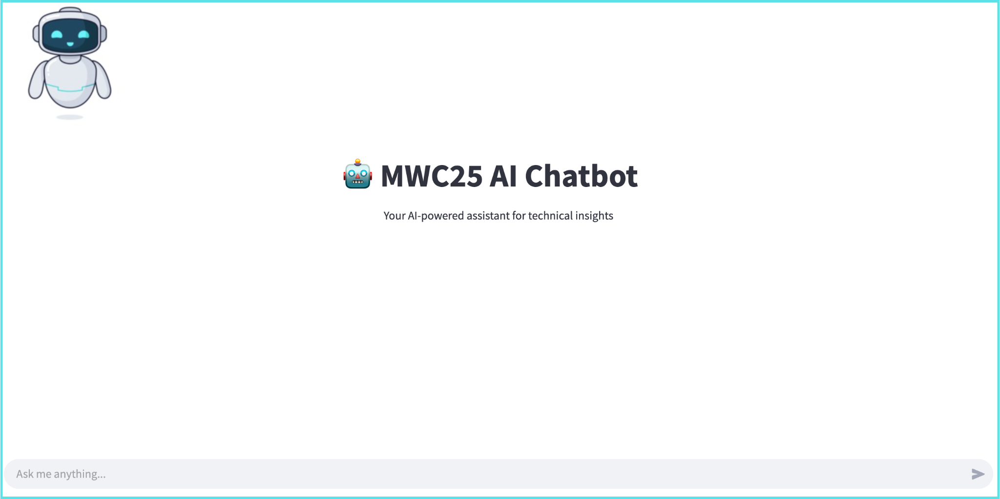

# AI+ Chatbot

<p align="center">
  
</p>

## About this Project

This project was developed for the **Mobile World Congress 2025 (MWC 2025) Workshop**, where participants will learn how to build and deploy an **AI+ powered chatbot** using **Python, Streamlit, and vector databases**.  

[MWC 2025](https://www.mwcbarcelona.com/) is one of the **world’s most influential technology events**, bringing together **industry leaders, developers, and innovators** to explore **the future of AI, digital transformation, and connectivity**. In 2025, AI is moving from research to large-scale **real-world implementation** across industries. 

### What is the AI+ Chatbot?  
App: 👉 [MWC25 AI+ Chatbot](https://mwc25-ai-chatbot.streamlit.app/)

The **AI+ Chatbot** is an **intelligent Q&A assistant** that enhances Generative AI (GenAI) models with **Retrieval-Augmented Generation (RAG)**. Unlike standard LLMs that rely solely on pre-trained data, **this chatbot retrieves real-time information from documents, databases, and APIs to provide more precise and reliable answers**.

## Prerequisites

Before setting up the project, ensure you have the following installed:

- **Python (3.9 or later)**  
- **An IDE**: We recommend **VS Code, PyCharm, or Jupyter Notebook**  
- **[Conda](https://docs.conda.io/projects/conda/en/latest/user-guide/install/index.html)** (for environment management)  
- **An API Key** from one of the following providers:
  - **[OpenAI API Key](https://platform.openai.com/signup/)**
  - **[Hugging Face API Key](https://huggingface.co/join)** (for custom models)

## Installation & Setup

If you are comfortable with **Conda and Streamlit**, follow these steps:

### 1️⃣ Clone the Repository
```sh
git clone https://github.com/your-username/rag-assistant.git
cd rag-assistant
```

### 2️⃣ Create & Activate the Conda Environment
```sh
conda create --name mwc25 python=3.9
conda activate mwc25
pip install -r requirements.txt  # Install dependencies
```

### 3️⃣ Store Your API Key (Required)
To store your API key securely, create a **`.streamlit/secrets.toml`** file in the project directory:

```sh
mkdir -p .streamlit
touch .streamlit/secrets.toml
```

Then, open the file and add your API key:

```toml
[api_keys]
openai = "your-api-key"
huggingface = "your-api-key"
```

### 4️⃣ Run the Application
```sh
streamlit run main.py
```

Once the app starts, open your browser at **`http://localhost:8501`** to interact with the AI assistant.

## Guides for Intermediate & Beginner Users

If you're new to **Conda, Streamlit, or API integrations**, refer to the **guides/** folder for step-by-step instructions:

## Project Structure

```sh
📂 MWC25-AI-Chatbot
│── 📂 app/                     # Main Streamlit app files
│   ├── main.py                 # Streamlit app entry point
│   ├── config.toml             # Non-sensitive configuration settings
│   ├── 📂 chroma_db/           # Vector database files
│── 📂 data/                     # Retrieval data
│   ├── example.pdf              
│── 📂 images/                   # Visual assets
│   ├── app.png                  
│   ├── logo.jpg                 
│── 📂 guides/                   # Self-guided materials for beginners
│   ├── Fundamentals.ipynb  
│── .gitignore                   
│── LICENSE                      # Open-source license (AGPL v3)
│── README.md                   
│── requirements.txt              # Dependencies for deployment on Streamlit
│── environment.yml               # YAML file for Conda environment setup
```

## License (AGPL v3)

GNU GENERAL PUBLIC LICENSE
Version 3, 29 June 2007

	This program is free software: you can redistribute it and/or modify it under the terms of the GNU General Public License as published by the Free Software Foundation.

Key Protections:
	1.	Freedom to Use & Modify – Open-source collaboration is encouraged.
	2.	Copyleft Requirement – If someone modifies and distributes your project, they must also share their modifications under the same GPL license.
	3.	Prevents Proprietary Use – Businesses cannot take your code and turn it into proprietary software.

🔗 Full license text: [GPL v3](https://www.gnu.org/licenses/gpl-3.0.html)
